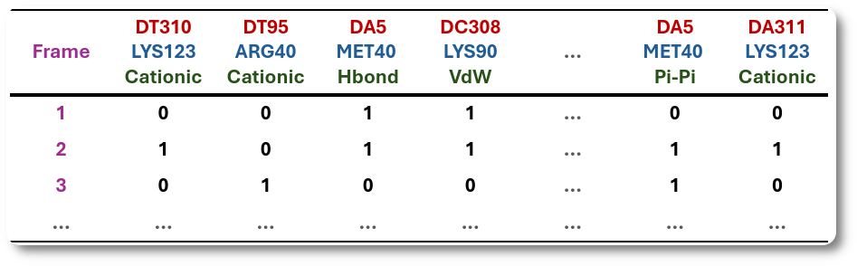

# Welcome to InterMap's documentation

**InterMap** is a tool for computing <u>interaction fingerprints</u> in Molecular Dynamics (MD). An interaction fingerprint is a vector that succinctly 
describes the chemical interactions between two selections in a molecular system as it is shown in the example below. It contains information about what residues (or atoms) are interacting and under what type of interaction.

{width="750"}
/// caption
Interaction fingerprints (black row vectors) of a DNA-protein MD simulation
///

The primary motivation behind InterMap is to provide a <u>flexible and efficient</u> way to compute interaction fingerprints for a wide range of molecular systems including <u>proteins, ligands, glycans, lipids, and nucleic acids</u>. 

This documentation incorporates detailed information on using InterMap, including installation instructions, usage examples, and explanations of the different interaction types and parameters. If you have any questions or feedback, please contact us through the issues section of the project on [GitHub](https://github.com/Delta-Research-Team/intermap).
