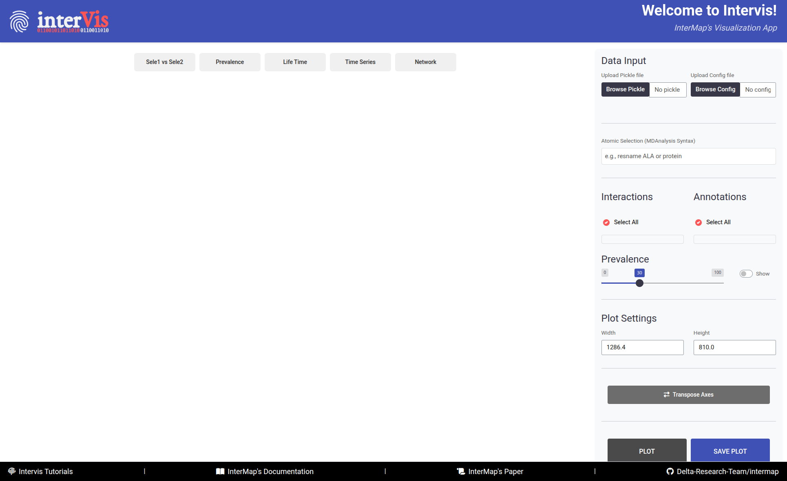
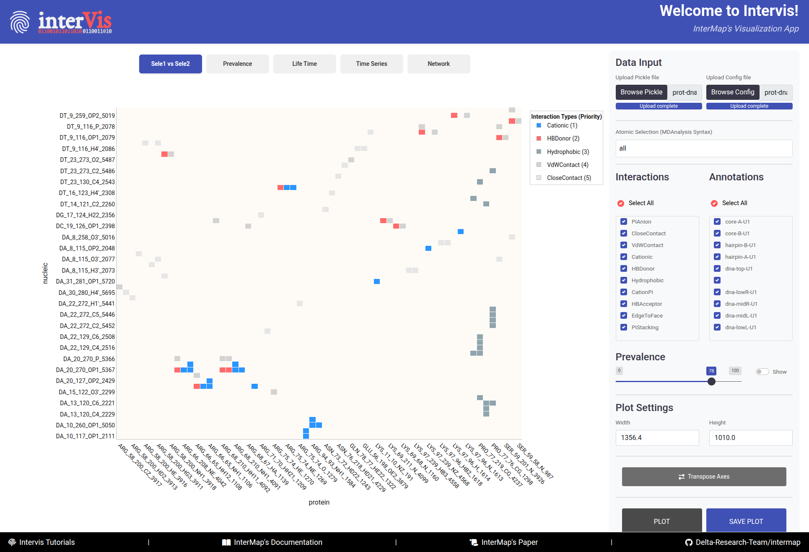
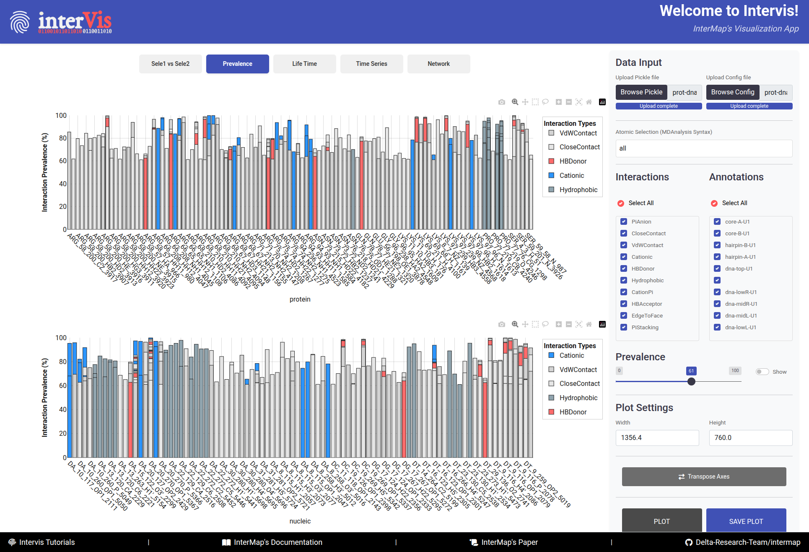
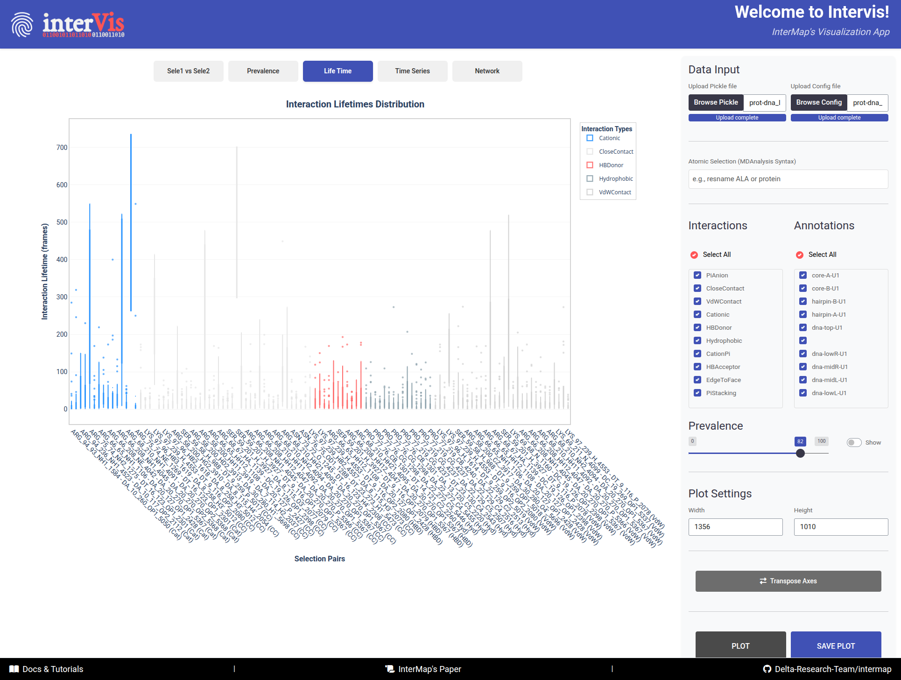
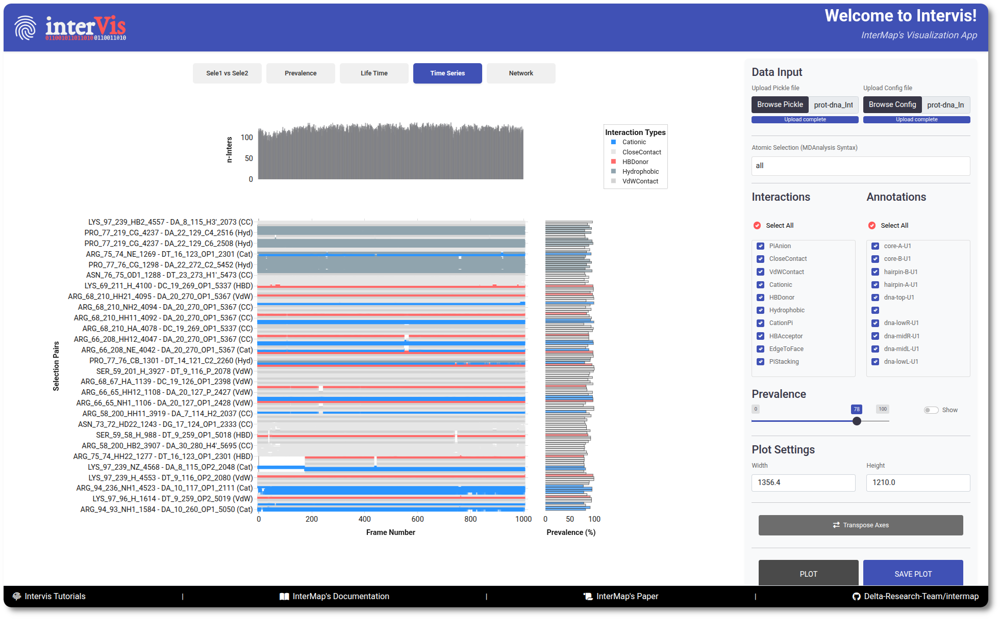
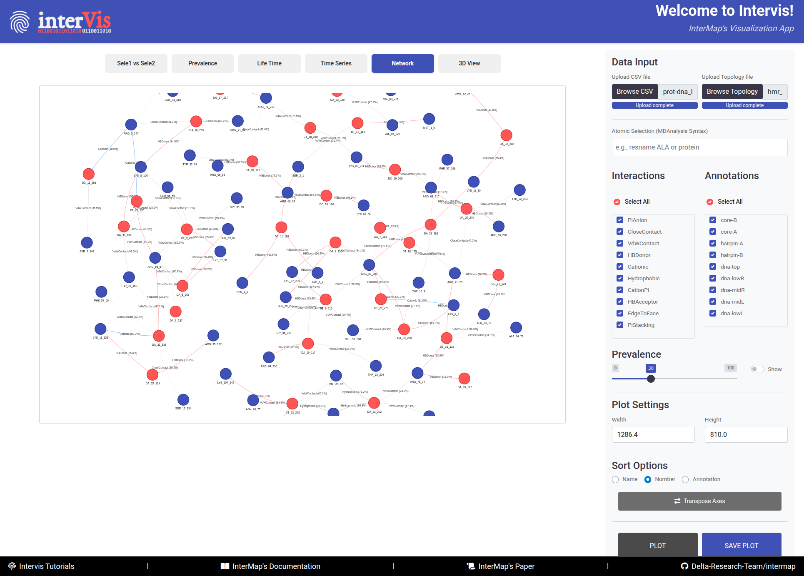

**InterMap** comes with a local, interactive Shiny application named **InterVis**, which allows users to explore the
interactions computed by the tool. This user-friendly web interface simplifies the analysis and interpretation of
molecular interaction data. No internet connection is required to run the app.

## 1. Launching InterVis

Once InterMap is installed and your virtual environment is activated, run the following command from the terminal:

```bash
intervis
```

This will automatically launch the InterVis server and open your default web browser with the app's interface.

{width="100%"}

/// caption
InterVis interface is composed of three main areas: the **Control Panel** (right side), the **Visualization Panel** (
left side), and the **Footer** (bottom bar).
///


The InterVis interface consists of three main areas:

- The ``Control Panel`` (right side) contains tools for loading and filtering data. It is always visible for quick
  access and its effects are reflected in the visualizations after clicking the ``Plot`` button.

- The ``Visualization Panel`` (left side) displays different types of visualizations. It is organized into tabs for
  smooth navigation and allows users to explore interaction data interactively.

- The ``Footer`` (bottom bar) provides links to the InterMap's documentation and tutorials, its scientific paper, and
  the GitHub repository.

## 2. Uploading Your Data

InterVis needs two files before attempting to visualize the interactions: the `.PICKLE` file containing the interaction
data and the `.CFG` file with the configuration parameters used during the InterMap analysis. You can upload these files
using the ``Control Panel`` on the right side of the interface.

- Click on `Browse PICKLE` / `Browse Config` to upload these file. Alternatively, you can drag and drop them into the
  designated area.

## 3. Configuring Your Visualizations

Once the files are uploaded, you can configure the visualizations that will render in the different tabs of the
``Visualization Panel`` using the following sections under the  ``Control Panel``.

??? note "Atomic Selections"

    - This textbox allows to filter interactions using the [MDAnalysis selection syntax](https://userguide.mdanalysis.org/stable/selections.html). Only atoms/residues that match the selection will be considered in the visualizations.

    !!! example "MDAnalysis Selection Examples"
    ```
    - "protein"                                          # All protein atoms
    - "resname ALA"                                      # All alanine residues
    - "protein and name CA"                              # Alpha carbon atoms in proteins
    - "resid 10 to 30"                                   # Residues with IDs from 10 to 30
    - "(resname ALA or resname VAL) and not name H*"     # Heavy atoms in ALA or VAL residues
    ```

??? note "Interactions"

    Upon uploading the `.PICKLE` file, InterVis will automatically detect all stored interactions and display them in this panel.

    - You can select one or multiple types. Click ``Select All`` to toggle all options.

??? note "Annotations"

    Upon uploading the `.PICKLE` file, InterVis will automatically detect all stored annotations and display them in this panel.
    
    - You can filter the visualized data based on the custom annotations defined in the configuration file.


    - You can select one or multiple annotations. Click ``Select All`` to toggle all options.


??? note "Prevalence Threshold"

    When the files are loaded, InterVis automatically assigns a default prevalence threshold of **30%**. You can adjust this value to filter out interactions based on their prevalence (0–100%).

    - The ``Show`` option will allow you to show/hide numeric values on plots.

## 4. Supported Visualizations

??? note "**Sele1 vs Sele2**"

    In this Tab, an overview of all interaction pairs between two selections is reported.

    {width="100%"}

    /// caption
    The **Sele1 vs Sele2** tab provides an overview of all interaction pairs between two selections.
    ///


    **`Interpretation Guide:`**

    - **X-axis**: Atoms/Residues of Selection 1 
 
    - **Y-axis**: Atoms/Residues of Selection 2

    - **Cells**
      - *Color:* Interaction type (following an interaction priority system — if multiple interactions occur, the most relevant is shown).
      - *Number:* Interaction prevalence (shown upon activation of the ``Show`` option adjacent to the ``Prevalence`` filter).
 
    - **Hover**
      - *Sel1:* Atom/Residue of the first selection
      - *Note1:* Annotation corresponding to Sel 1
      - *Sel2:* Atom/Residue of the second selection
      - *Note2:* Annotation corresponding to Sel 2
      - *Interaction:* Type of interaction
      - *Prevalence:* Percentage of frames with this interaction

    - **Transpose Button** to swap X/Y axes — useful for alternate views

??? note "**Prevalence**"

    In this Tab, the prevalence of interactions is visualized as a bar chart. In the top panel, the interactions of Selection 1 are shown, while the bottom panel focuses on Selection 2.
    
    {width="100%"}

    /// caption
    The **Prevalence** tab visualizes the prevalence of interactions as a bar chart, with Selection 1 in the top panel and Selection 2 in the bottom panel.
    ///


    **`Interpretation Guide:`**

    - **X-axis**: Components from Selection 1/Selection 2

    - **Y-axis**: Prevalence (%)

    - **Bars**:
        - *Color:* Interaction type
        - *Height:* Prevalence percentage

    - **Hover**:
      - Selection_1: Prevalence of interaction in Selection 1
      - Selection_2: Prevalence of interaction in Selection 2
      - Interaction: Type of interaction
      - Prevalence: Percentage of frames with this interaction
      - Annotation: Custom annotation for the interaction


### 4.3. Tab 3: Life Time

Violin plots representing the distribution of interaction lifetimes.

{ width="100%" }


**`Plot Elements:`**

- **Violin Shape**: Distribution of durations
- **Width**: Relative frequency
- **Color**: Interaction type

**`Internal Markers:`**

- **Center line**: Median
- **Box**: Interquartile range
- **Dots**: Outliers

**`Interpretation:`**

- Wide violins = variable interactions
- Narrow violins = stable interactions
- Outliers = rare yet stable periods

!!! info "Hover"

    - Pair: Selection 1 – Selection 2
    - Interaction: Type
    - Prevalence: XX.X%
    - Lifetime: Frames
    - Frame Range: Start–End


### 4.4. Tab 4: Time Series

Tracks the occurrence of interactions over time.

{ width="100%" }

**`Components:`**

1. **Main Panel**
    - **X-axis**: Frame number
    - **Y-axis**: Interaction pairs
    - **Dots**: Interaction present
2. **Top Histogram**
    - Number of interactions per frame
3. **Side Histogram**
    - Total prevalence per pair

**`Interpretation:`**

- Identify synchronous events
- Track stable vs. transient interactions
- Reveal dynamic behavior

!!! info "Hover"

    - Frame: Frame number
    - Selection Pair: Interacting residues
    - Interaction: Type
    - Prevalence: Global %


### 4.5. Tab 5: Network

Interactive molecular network view.

{ width="100%" }


**`Elements:`**

- **Nodes**:
    - 🔵 Blue = Selection 1 components
    - 🔴 Red = Selection 2 components
- **Links**:
    - **Color**: Interaction type
    - **Number**: Prevalence
    - **Length**: Inversely related to prevalence

**`Features:`**

- Drag & rearrange nodes
- Zoom and pan
- Hover to reveal details
- Automatic layout adjustments
